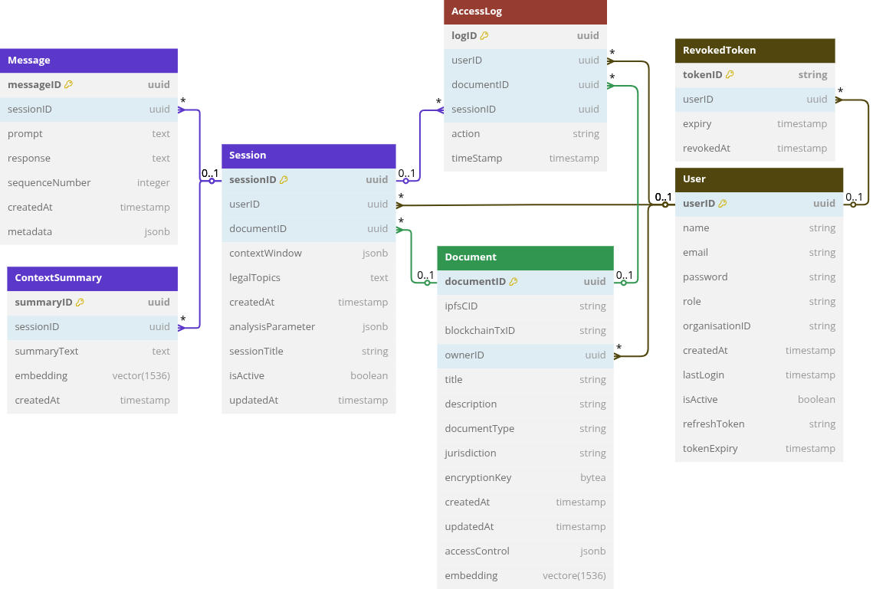

# Readme
## Introduction

this is the Backend for my thesis application, designed using ASP.NET Core

* * *

## Design

### Backend Components

<figure class="image"></figure>

> [!IMPORTANT]
> The IPFS and Hyperledger fabric services are not yet set up

### Database

The database is designed for PostgreSQL

<figure class="image"></figure>

* * *

## Set up

1.  if you don't have ASP.NET Core 8 already installed pleas follow the instruction in from the [official website](https://learn.microsoft.com/en-us/dotnet/core/install/) , you can check the version of the installed framework using:
    
    ```sh
    dotnet --version 
    ```
2.  after installing ASP.NET you need to have the Entity Framework took and add it to the PATH environment variable
    
    ```sh
    dotnet tool install --global dotnet-ef
    export PATH=$HOME/.dotnet/tools:$PATH >> ~/.zshrc #~/.bashrc
    dotnet ef --version
    ```
3.  in case you don't have PostgreSQL on your machine you can download it from the [official website](https://www.postgresql.org/download/https://www.postgresql.org/download/), then depends on your operating system you can search how to add a new user to PostgreSQL, you can check from the database version using:
    
    ```sh
    psql --version
    ```
4.  now execute this query create a the database
    
    ```sql
    CREATE DATABASE thesisappdb;
    ```

> [!WARNING]
> If you don't have the [pgvector](https://github.com/pgvector/pgvector.git) extension follow the instruction from their GitHub repository

5.  now you can clone the repository
    
    ```sh
    git clone https://github.com/rami-shalhoub/Thesis-Backend.git
    ```
6.  fist open `appsetting.json` and fill the following
    
    ```json
    "ConnectionStrings": {
          "DefaultConnection": "Host=localhost;Database=thesisappdb;Username=`your user name`;Password=`your password`"
       },
       "JWT": {
          "Secret": "your secret sentence for the JWT",
          "Issuer": "thesis-app",
          "Audience": "client",
          "AccessTokenExpirationMinutes": 120,
          "RefreshTokenExpirationDays": 7
       },
       "DeepSeek": {
          "ApiKey": "your Deepseek API key",
          "ApiUrl": "https://api.deepseek.com/v1",
          "Model": "deepseek-chat",
          "MaxTokens": 2048,
          "Temperature": 0.7,
          "OpenAIApiKey": "you OpenAI API key for generating the embedding vectors"
       }
    ```

> [!NOTE]
> it is not necessary to provide an OpenAI API key as the generation of the embedding key has some problem and is not working as expected

7.  then you need to migrate the data models to the database 
    
    ```sh
    dotnet ef database update
    ```
8.  now you can start the backend by running
    
    ```sh
    dotnet watch 
    ```

* * *

> [!NOTE]
> after logging in, copy the generated access toke and past it in the top green button \[Authorize\] to get access to the endpoints that requires authorisation