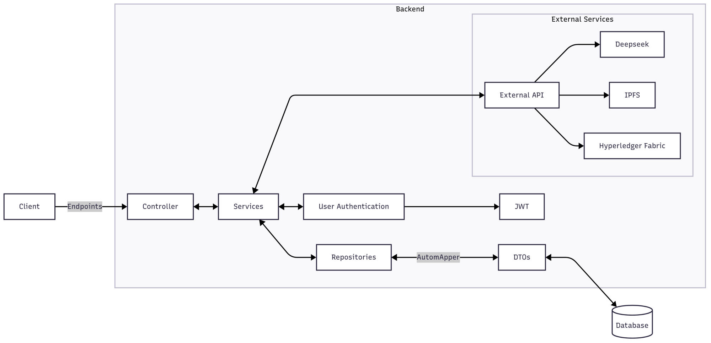

## Introduction

this is the Backend for my thesis application, designed using ASP.NET Core

- [x] user authentication endpoints
- [x] chat services endpoints
- [ ] upload document endpoint
- [ ] blockchain gateway connection

* * *

## Design

### Backend Components

<figure class="image image_resized"></figure>

> [!IMPORTANT]
> The IPFS and Hyperledger fabric services are not yet set up

### Database

The database is designed on PostgreSQL

<figure class="image" style="width:200%;"></figure>

* * *

## Set up

> [!IMPORTANT]
> The project with its set up steps has been developed and tested on Ubuntu
> 
> When operating on Windows OS, there should theoretically not be an issue. However, please test at your own discretion as there might be some discrepancies and differences in operation the setup 

1.  if you don't have ASP.NET Core 8 already installed pleas follow the instruction in from the [official website](https://learn.microsoft.com/en-us/dotnet/core/install/) , you can check the version of the installed framework using:
    
    ```sh
    dotnet --version 
    ```
2.  after installing ASP.NET you need to have the Entity Framework took and add it to the PATH environment variable
    
    ```sh
    dotnet tool install --global dotnet-ef
    export PATH=$HOME/.dotnet/tools:$PATH >> ~/.zshrc #~/.bashrc
    dotnet ef --version
    ```
3.  in case you don't have PostgreSQL on your machine you can download it from the [official website](https://www.postgresql.org/download/https://www.postgresql.org/download/), then depends on your operating system you can search how to add a new user to PostgreSQL, you can check from the database version using:
    
    ```sh
    psql --version
    ```
4.  now execute this query create a the database
    
    ```sql
    CREATE DATABASE thesisappdb;
    ```

> [!WARNING]
> If you don't have the [pgvector](https://github.com/pgvector/pgvector.git) extension follow the instruction from their GitHub repository

5.  now you can clone the repository
    
    ```sh
    git clone https://github.com/rami-shalhoub/Thesis-Backend.git
    ```
6.  fist open `appsetting.json` and fill the following
    
    ```json
    "ConnectionStrings": {
          "DefaultConnection": "Host=localhost;Database=thesisappdb;Username=`your user name`;Password=`your password`"
       },
       "JWT": {
          "Secret": "your secret sentence for the JWT",
          "Issuer": "thesis-app",
          "Audience": "client",
          "AccessTokenExpirationMinutes": 120,
          "RefreshTokenExpirationDays": 7
       },
       "DeepSeek": {
          "ApiKey": "your Deepseek API key",
          "ApiUrl": "https://api.deepseek.com/v1",
          "Model": "deepseek-chat",
          "MaxTokens": 2048,
          "Temperature": 0.7,
          "OpenAIApiKey": "you OpenAI API key for generating the embedding vectors"
       }
    ```

> [!NOTE]
> It is not necessary to provide an OpenAI API key as the generation of the embedding key has some problem and is not working as expected

7.  then you need to migrate the data models to the database 
    
    ```sh
    dotnet ef database update
    ```
8.  now you can start the backend by running
    
    ```sh
    dotnet watch 
    ```

* * *

## Endpoints

### User Auth

*   Register: for registering a new user

> [!NOTE]
> Available Organisations: ClientOrgMSP, LawfirmOrgMSP, RetailOrgMSP  
> Available Role: client, peer, admin

*   Login: signing using the user email and password

> [!IMPORTANT]
> After logging in, copy the generated access toke and paste it in the top green button \[Authorize\] to get access to the endpoints that requires authorisation

*   log out: Logging the user out and revoke their refresh token
*   refresh-token: To refresh the access token.
*   update user: To update the user name, email, and organisation. Requires the user ID. Need Authorisation
*   delete user: To delete the user from the database with any data connected to this session in other tables. Requires the user ID. Need Authorisation

### Chat (Need Authorisation)

*   create session: Create a session. Requires the user ID
*   get a session with its messages: Requires the session ID
*   get all sessions
*   delete a session: Delete the session from the database with any data connected to this session in other tables. Requires a session ID
*   delete all session: Delete all the sessions from the database with any data connected to them in other tables. Requires the user ID
*   message: Send a message to the LLM, the response will contain an answer to the user question whit the relevant sources. Requires a session ID
*   close session: Closing an active session. Requires a session ID